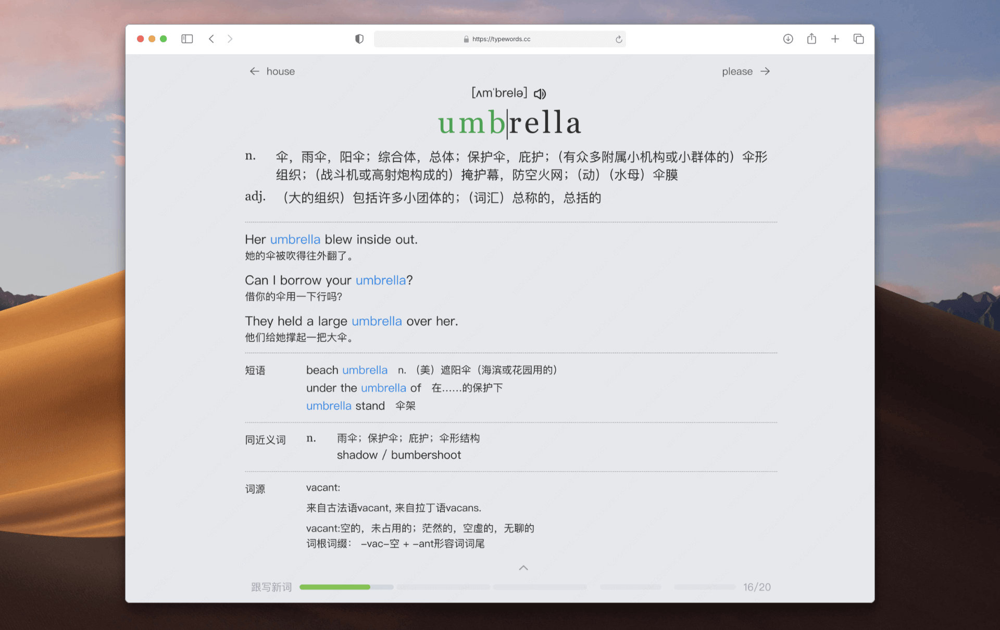

# TypeWords

> A local-first vocabulary learning application for English learners.

## What is TypeWords?

TypeWords helps learners practice English vocabulary through typing, spaced review, and structured vocabulary sets. It is designed to provide a lightweight, distraction-free, and local-first learning experience with 194 built-in dictionaries (277,000+ words).

## Demo



## Quick Start

```bash
git clone https://github.com/Dyu20705/TypeWords.git
cd TypeWords
pnpm install
pnpm dev
```

Open [http://localhost:5567](http://localhost:5567).

## Documentation

| Need | Documentation |
|---|---|
| Understand product vision & learning modes | [Product Guide](docs/PRODUCT.md) |
| Understand architecture & offline storage | [Architecture Guide](docs/ARCHITECTURE.md) |
| Setup local development & run tests | [Development Guide](docs/DEVELOPMENT.md) |
| Manage vocabulary pipeline & deploy | [Operations Guide](docs/OPERATIONS.md) |
| Inspect data schemas & specifications | [Technical Reference](docs/REFERENCE.md) |
| Look up keyboard shortcuts & modes | [Cheatsheet](docs/CHEATSHEET.md) |
| Check 194 dictionaries benchmark report | [Benchmark Report](scripts/vocabulary/benchmark-report.md) |
| Vietnamese landing page | [Bản Tiếng Việt](docs/README.vi.md) |

## Status

**Development** — Core vocabulary learning and offline workflows are fully functional. Vietnamese localization is in active development.

## License

MIT License — see [LICENSE](LICENSE). Upstream repository: [zyronon/TypeWords](https://github.com/zyronon/TypeWords).
