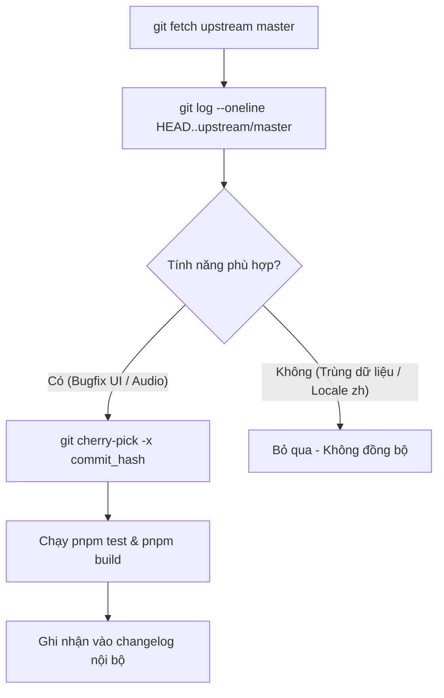

# TypeWords — Quy Chuẩn Ranh Giới Với Kho Lưu Trữ Gốc (Upstream Boundary Specification)

> **Tài liệu kiểm soát ranh giới kỹ thuật (Technical Governance)**  
> **Repository Bản Fork**: [`Dyu20705/TypeWords`](https://github.com/Dyu20705/TypeWords)  
> **Repository Upstream Gốc**: [`zyronon/TypeWords`](https://github.com/zyronon/TypeWords)  
> **Commit Gốc Khi Fork (Base Commit)**: `633e179c1197c84325ad92fb983d3435dfe4b37a`

---

## 1. Tôn Chỉ Ranh Giới (Core Boundary Principle)

> [!IMPORTANT]
> **Cam Kết Bất Biến (Non-Negotiable Policy)**:
> 1. Toàn bộ các thay đổi kiến trúc, kỹ nghệ dữ liệu, bản địa hóa tiếng Việt, refactor domain và hạ tầng lưu trữ trong repository này được thiết kế và thực thi **độc quyền** cho bản fork `Dyu20705/TypeWords`.
> 2. **TUYỆT ĐỐI KHÔNG TẠO PULL REQUEST (PR), ĐẨY NHÁNH HOẶC SYNC CÁC THAY ĐỔI NÀY LÊN UPSTREAM (`zyronon/TypeWords`)**.
> 3. Kho lưu trữ upstream chỉ đóng vai trò là **nguồn tham chiếu (read-only reference source)** để theo dõi các bản vá lỗi giao diện hoặc tính năng mới của tác giả gốc.

---

## 2. Danh Mục Các Phân Kỳ Có Chủ Ý (Intentionally Diverged Subsystems)

Các phân hệ dưới đây đã được chủ động chuyển hướng kiến trúc và sẽ **vĩnh viễn không đồng nhất** với upstream:

| Phân Hệ | Hiện Trạng Upstream (`zyronon/TypeWords`) | Định Hướng Bản Fork (`Dyu20705/TypeWords`) | Lý Do Phân Kỳ |
| :--- | :--- | :--- | :--- |
| **Quốc tế hóa (i18n)** | Tiếng Trung giản thể (`zh-CN`) làm mặc định; hỗ trợ 14 ngôn ngữ không hoàn chỉnh | **Tiếng Việt (`vi`) làm mặc định**, tiếng Anh (`en`) làm phụ trợ; loại bỏ 12 locale rác | Tối ưu hóa dung lượng bundle, nâng chất lượng bản dịch tiếng Việt lên hạng nhất |
| **Định danh CSDL (DB Identity)** | Dùng chuỗi tiếng Trung làm khóa IndexedDB: `'收藏'`, `'错词'`, `'已掌握'` | **Locale-Neutral Keys**: `wordCollect`, `wordWrong`, `wordKnown`, `articleCollect` | Tránh lỗi trùng lặp/mất dữ liệu khi người dùng chuyển đổi ngôn ngữ hiển thị |
| **Kho Dữ Liệu Từ Điển** | 194 tệp từ điển tiếng Anh - Trung; trường nghĩa `trans[].cn` chứa tiếng Trung | **Song ngữ Anh - Việt**: Nghĩa tiếng Việt chuẩn ngữ cảnh; lưu vết tiếng Trung gốc qua `cn_source` | Phục vụ người học tiếng Anh tại Việt Nam |
| **Kỹ Nghệ Dữ Liệu** | Tải và sửa đổi trực tiếp các tệp JSON trong `public/dicts/` | **Tách biệt Pipeline ngoài runtime**: `data/sources` $\to$ `normalized` $\to$ `localized` $\to$ `public/` | Chuẩn hóa quy trình dữ liệu, kiểm định 3 tầng Quality Gates, lưu vết provenance |
| **Dịch Vụ Ngoại Vi** | Tích hợp Baidu Analytics (`hm.baidu.com`), máy chủ `libs.typewords.cc`, mã QR WeChat/QQ | **Loại bỏ 100% telemetry và dịch vụ nội địa Trung Quốc** | Bảo vệ quyền riêng tư người dùng, loại bỏ phụ thuộc mạng bên ngoài lãnh thổ |

---

## 3. Quy Trình Đồng Bộ Upstream An Toàn (Upstream Synchronization Protocol)

Khi upstream có các cập nhật mới (vd: sửa lỗi Web Audio bàn phím cơ, tối ưu hiệu năng Vue 3):



### Các bước thực hiện:
1. **Thiết lập remote upstream** (chỉ đọc):
   ```bash
   git remote add upstream https://github.com/zyronon/TypeWords.git
   git remote set-url --push upstream DISABLE_PUSH_TO_UPSTREAM
   ```
2. **Kiểm tra commit mới**:
   ```bash
   git fetch upstream master
   git log --oneline --no-merges HEAD..upstream/master
   ```
3. **Đồng bộ chọn lọc (Selective Cherry-Pick)**:
   Chỉ cherry-pick các commit đơn lẻ giải quyết lỗi thuật toán gõ phím hoặc hiệu ứng âm thanh:
   ```bash
   git cherry-pick -x <commit_hash>
   ```
4. **Xử lý xung đột (Conflict Handling)**:
   - Nếu commit chạm vào `i18n/`, `public/dicts/`, `public/list/`, hoặc `app/core/persistence/`: **HỦY BỎ NGAY** (`git cherry-pick --abort`) và tự viết bản vá riêng phù hợp với kiến trúc fork.

---

## 4. Tệp Tin Nhạy Cảm - Tuyệt Đối Không Ghi Đè Khi Đồng Bộ

* `i18n/locales/vi.json` & `en.json`
* `app/core/utils/migration.ts` (và thư mục `app/core/persistence/` sau này)
* `public/dicts/en/word/*.json` & `public/dicts/en/article/*.json`
* `public/list/word.json` & `article.json`
* `package.json` (các script kiểm định chất lượng và pipeline `data:*`)
* Toàn bộ thư mục `data/` và `tests/`
